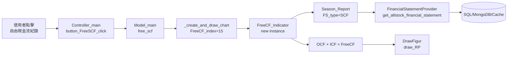

# 自由現金流圖表功能 — 設計規格

## 概述

修復主畫面「自由現金流紀錄」按鈕（`button_getFreeCF`），使其能正確繪製自由現金流（Free Cash Flow）歷史圖表。

## 計算公式

```
自由現金流 = 營業活動現金流量(OCF) + 投資活動現金流量(ICF)
```

資料來源為季財務報表中的現金流量表（SCF）。

## 架構與資料流



## 影響模組

| 模組 | 變更類型 | 說明 |
|------|----------|------|
| `src/Model/Model_main.py` | 修改 | FreeCF_index 分支改用 `FreeCF_Indicator` |
| `src/FilterService/StockReportHistory.py` | 無變更 | `FreeCF_Indicator` 邏輯已正確 |
| `src/Controller/Controller_main.py` | 無變更 | 按鈕連接已存在 |
| `UI/UI_main.ui` | 無變更 | 按鈕已存在 |

## 邊界情況處理

- **無股票代號輸入**：`_create_and_draw_chart` 回傳 None 並提示「請輸入股票號碼」
- **今日日期作為結束日**：提示「今天還沒過完無資資訊」
- **無 SCF 資料**：`FreeCF_Indicator.get_ALL_Report` 回傳空 DataFrame，跳過繪圖
- **OCF 或 ICF 欄位缺失**：`check_and_convert_to_series` 處理對齊失敗後回傳空結果

## 測試驗證

1. 語法檢查：`import ast; ast.parse(open('src/Model/Model_main.py').read())`
2. 匯入檢查：`from src.Model.Model_main import Model_main`
3. 既有測試：執行 `pytest tests/` 確認無新增失敗
